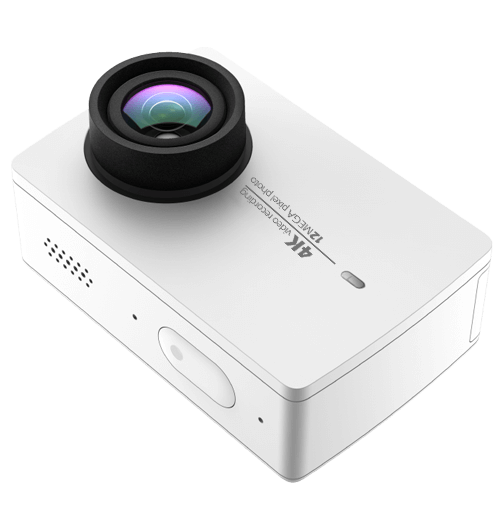

# yi4k-sdk-js
YI 4k Action Camera Controlling with NodeJS

<div align="center">
  
</div>
NOTES: This SDK is unofficial and still under development

<h2>API Commands</h2>

```javascript
delay(ms: number): Promise<typeof setTimeout>;
getConfig(): Promise<object>;
startLiveStream(): Promise<object>;
stopLiveStream(): Promise<object>;
getBattery(): Promise<object>;
switchPhoto(): Promise<object>;
takePicture(): Promise<object>;
switchVideo(): Promise<object>;
timerRecordVideo(): Promise<object>;
startRecordVideo(): Promise<object>;
stopRecordVideo(): Promise<object>;
downloadFile(file: string, dest: string): Promise<string>;
getFileList(): Promise<object>;
getFileInfo(fName: string): Promise<object>;
```

<h2>How to use</h2>
See <strong>examples</strong> folder
